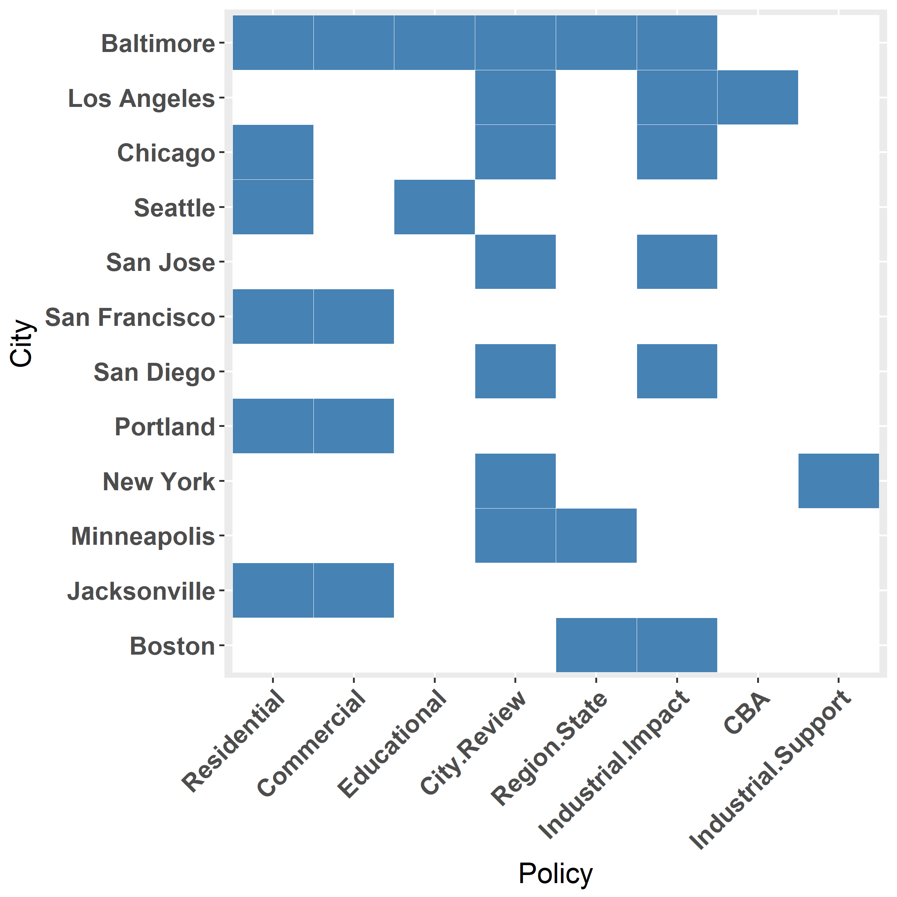

#Introduction 

Widening social inequality amidst unprecedented growth poses a fundamental challenge to planners in the nation's largest cities. A major driver of this growing inequality is the loss of "good jobs" at the lower end of the labor market in many cities [@kalleberg_good_2011; @bernhardt_organizing_2016]. Due to the inability, or unwillingness, of cities and states to pass labor market policies such as mandated leave, living wage ordinances, or hiring supports, economic development planners are left primarily with industrial strategies to grow the number of "good jobs". Unfortunately, the kinds of jobs that do provide good jobs to workers with a wide range of educational attainment- industrial jobs- have the least amount of physical space in cities to operate, and, in many instances, are being actively pushed out by existing land-use police.  

A central conflict in many cities now, then, is what to do about industrial land. Recent planning scholarship highlights how many city policies actually actively displace industrial users (and by extension the jobs they produce and the workers who fill them) [@leigh_smart_2012; @wolf-powers_up-zoning_2005; @lester_making_2013]. Planners, and cities, are starting to recognize that industrial land is an important asset and the APA recently released a policy guide for cities looking to grow their industrial workforces [@leigh_sustainable_2014]. A consistent message in these studies is that industrial land should be protected and that cities should pass additional protections in order to guarantee such lands will be used for jobs production in the future. While valuable resources exploring how land-use policy is a primary driver in industrial displacement, no one study has yet done a more systematic survey of protective industrial land-use policies.  

In this study, I review the industrial land-use policies of the nation's fifty largest cities to see to what extent industry preservation policy is actually used. I identify industry protective policies as land-use policies that offer additional protections to industrial land users and that frame industrial jobs and land as positive features of the city and not simply as nuisance uses to be managed. 

My research shows that industrial preservation policy is relatively common among the nation's largest cities, and where present, vary on whether they focus on adding additional use restrictions or imposing additional process requirements for conversion.  

#Background

##Local Politics and Planning's Fiscal Imperatives

While there is growing recognition of the importance of protecting industrial lands for economic development, what has been the status of industrial land for planners historically? Conflicts over industrial land are hardly new but the role of planners in these disputes is changing and recent research on the role industrial land plays in greater economic development suggests that planners should challenge the conventional wisdom that dominates many discussions on the proper role of industrial lands.  

Planners have very real incentives to convert industrial land to non-industrial uses, but there are also ideological and organizational constraints that steer planners towards support of city-led deindustrialization. For example, Wolf-Powers [-@wolf-powers_up-zoning_2005] describes the current patterns of industrial land conversion in New York as a response to the need of cities to maximize property tax receipts in the face of decreased federal support starting in the 1970s. But beyond these urgent fiscal constraints Wolf-Powers also identifies how particular *modes* of planning- specifically an opportunistic and entrepreneurial approach to planning- as opposed to more comprehensive ways of planning also encourage the conversion of scarce, yet attractively located, tracts of industrial land. Wolf-Powers contrasts this entrepreneurial mode that explicitly privileges real-estate values with more deliberate approaches that explicitly weigh development decisions on a broader array of goals and values. 

Beyond fiscal constraints and a more atomistic, entrepreneurial planning approach, Wolf-Powers also identifies how planners' vision of an ideal labor market drives development decisions. More specifically, Wolf-Powers identified a predominate opinion among New York planners that industrial work was either absent due to deindustrialization driven by global competition or on the cusp of obsolescence. Planners' alternative vision, then, was one where the city's labor market would specialize even more in tourism and FIRE industries. In their vision of a globally competitive city there was no room, or need, for industrial users and workers. While Wolf-Powers (2005) finds that planners engage in "passive deindustrialization" due to a variety of personal and institutional factors, Rast's [-@rast_manufacturing_2001] history of post-war development politics in Chicago shows urban deindustrialization to be a deliberate strategy encouraged by downtown coalitions seeking to restructure central cities in their own image and how these patterns of deindustrialization and conversion were countered by the rise of strong neighborhood coalitions looking to protect industrial jobs. Both Wolf-Powers and Rast focus on the explicitly local *political* nature of urban industrial employment and challenge the conventional wisdom of a primarily structural/fiscal explanation of deindustrialization driven by increased competition from abroad and capital flight. 

##Smart Growth and Industrial Development

Scholars such as Wolf-Powers and Rast present the political economic contexts in which planners operate in New York and Chicago. More recently, planning scholars have taken up more extensive reviews of planning policy concerning industrial land. Nancey Leigh is arguably the foremost advocate for urban industrial employment and land in academic planning and is a key bridge linking the local political economic analyses of Wolf-Powers (2005) and Rast (2001) to broader reviews of industrial land-use policy across the US. Leigh and Hoelzel [-@leigh_smart_2012] review of Smart Growth manuals and policies across the country show that the dominant movement in land-use planning in the last three decades, Smart Growth, largely frames industrial land as drag on local economies and sources of environmental contamination. Rejecting this frame, Leigh and Hoelzel [-@leigh_smart_2012] note the myriad uses for industrial land have in addition to local fiscal priorities and private sector employment including, but not limited to: space for public vehicles and infrastructure such as transit agency garages; limiting further job sprawl and spatial mismatch between workers and job locations; and creating more resilient, innovative local economies by having a true mix of industries present in our cities. 

Leigh and Hoelzel highlight an emerging new center of conflict for cities that are now aware of impending industrial land shortages and a land-use policy paradigm in Smart Growth that does not allow for industrial users in its vision for the city. The American Planning Association has stepped into the conceptual and policy gap here offering a guide for *Sustainable Industrial Development* [@leigh_sustainable_2014]. The 2014 Planning Advisory Service guide, authored by Leigh and others, offers support for the importance of industrial land in cities, directions on surveying and analyzing industrial land supply, and coverage of different policies select cities have made concerning industrial land preservation. Chapter three, in particular, covers land-use controls and offers a broad review of regulatory (read: zoning) tools in New York, Chicago, Philadelphia and Seattle.

##Redevelopment and Labor Market Change  

Ultimately, advocates for industrial land preservation assume that the supply of industrial land in cities is good for local economies. Such an argument is open to the critique that intensifying industrial lands, especially with commercial space, will allow for more jobs and preserving industrial land ultimately stunts economic growth. But recent studies challenge this conventional wisdom by highlighting the role that available industrial land plays in seeding new businesses and jobs and the local labor market effects of converting industrial land to non-industrial uses.

Chapple [-@chapple_highest_2014], in a study of four cities in the Bay Area of California, estimates the role of industrially zoned land in regional business dynamics, specifically job and firm expansion. Chapple (2014) finds that controlling for site, firm, and neighborhood characteristics, job growth is more positively associated with businesses located in industrially zoned areas than businesses in non-industrially zoned areas. Chapple finds that industrially zoned land seeds greater job and business growth by offering the potential for firms to grow *in place* as opposed to attracting already mature firms into the region. Also, because Chapple's study uses four Bay Area cities the findings offer strong support for preserving industrial land in strong market cities where demand for industrial land conversion is often the greatest. While Chappel focuses on the regional business dynamics of industrial land, Lester and Hartley [-@lester_making_2013] look at local (census tract level) employment change in the face of gentrification. They find that gentrifying tracts had faster job growth but that pre-existing industrial jobs were replaced by less well compensated restaurant and retail work. In their analysis they find find that gentrifying forces are themselves partially responsible for local industrial change. While Lester and Hartley (2013) do not explicitly test zoning, they do highlight the importance of local land-use change as a key driver in urban industrial restructuring, again drawing our attention to local planning dynamics as an important determinant in economic change. 

The literature suggests that industrially zoned land plays an important role in greater business dynamics, regional economic resilience, and more equitable local labor market outcomes. Amidst a growing realization of the shortage of productive land in central cities more cities are undertaking industrial land supply studies [@dempwolf_evaluation_2010] and taking industrial land management seriously. But there remain open questions as to what policies cities are currently taking, in particular do we see cities taking advantage of protective zoning similar to Chicago's Planned Manufacturing Districts [@fitzgerald_economic_2002] to protect industrial land?  

#Methodology and Data

This study is a content and descriptive analysis of land-use policies (both zoning codes and comprehensive plans)[^1] of the US's fifty largest cities, by population, in 2012. In the codes I identify industrial preservation policies on two criteria, the first functional and the second more discursive:

1.  The code is distinct and protective- The code is in addition to the standard manufacturing zones and lists a stronger set of protections or limitations on uses of the land than is found in the standard codes
2.  Industrial Land is an asset- The code does not frame industrial land as a nuisance but as an asset that is important for the local economy/job base

I chose these two measures in order to precisely identify policies reflective of a political orientation towards industrial land and the jobs it supports. of cities to different land uses. I decided upon identifying separate and distinct policies as recent studies show that cities that do adopt industrial preservation policies often designate protected districts as opposed to increasing protections on all existing manufacturing land [@leigh_smart_2012, @leigh_sustainable_2014]. Secondly, Green-Leigh and Hoelzel (2012) highlight the importance of discourse surrounding industrial land and moving from a deficit or nuisance frame to one of an asset. For an archetypal example, take Chicago's Planned Manufacturing District ordinance [@city_of_chicago_pmd_1988]:

\begin{small}

17-6-0401-A Purpose. The "PMD", *planned manufacturing district* zoning classification is intended to:

\begin{enumerate}
    
  \item   foster the city's industrial base;     
  \item   maintain the city's diversified economy for the general welfare of its citizens;
  \item   strengthen existing manufacturing areas that are suitable in size, location and character and which   the City Council deems may benefit from designation as a PMD;
  \item   encourage industrial investment, modernization, and expansion by providing for stable and predictable industrial environments; and
  \item   help plan and direct programs and initiatives to promote growth and development of the city's industrial employment base.  

\end{enumerate}

\end{small}

Chicago's defining PMD ordinance demonstrates the asset-based view of industrial land well as well as explicitly linking the preservation of industrial land with zoning to greater planning priorities. In terms of use, PMD review requires prospective developers to estimate the impact on surrounding industrial users explicitly in filing for a rezoning as part of the review. This extra layer of review and impact assessment act as an effective bridge on industrial parcel conversion.

Beyond identifying the codes, I also marked what kinds of additional restrictions were required (residential, commercial, retail, restaurants, healthcare sites, day cares, primary/secondary educational institutions, and public buildings). Additionally, I attempted to code whether or not the listed policy required additional review compared to the standard zoning code and at what levels that review is made. For example, applications for rezoning protected industrial lands in Minneapolis trigger a comprehensive plan amendment process that requires both city and regional review.

In addition to the code review, I noted the year the industrial protective ordinance was passed if possible, whether or not the city performed an industrial land-use study and the year in which it was commissioned. 

#Results

Industrial land preservation zoning is more common across the nation's largest cities than many would assume based on the coding criteria. Twelve of the nation's largest cities have some variant of industrial preservation/conservation zoning. These twelve cities held over twenty one and a half million people in 2012, and while they are geographically dispersed, industrial preservation zoning is concentrated in west coast cities from San Diego to Seattle.

| City          | State | Population, 2012 | Year Ordinance Passed |
|---------------|:-----:|:----------------:|:---------------------:|
| Los Angeles   |   CA  |     3,857,799    |          2008         |
| Chicago       |   IL  |     2,714,856    |          1988         |
| San Diego     |   CA  |     1,338,348    |          2008         |
| Jacksonville  |   FL  |      836,507     |          2007         |
| San Francisco |   CA  |      825,863     |          2008         |
| Boston        |   MA  |      636,479     |          1978         |
| Seattle       |   WA  |      634,535     |          2002         |
| Baltimore     |   MD  |      621,342     |          2004         |
| Portland      |   OR  |      603,106     |          1988         |
| San Jose      |   CA  |      982,765     |          2007         |
| Minneapolis   |   MN  |      392,880     |          2009         |
| New York      |   NY  |     8,199,221    |          2006         |

Table 1: Cities with Industrial Preservation Policies

##Code Differences

While each city has their own unique implementation of protective codes their variation can be divided into two broad categories: use restrictions and process rules. Use rules refer to the actual allowed uses listed by the city within the zones of interest. For example, Chicago's PMDs have a blanket ban on residential uses, whereas the city's other industrially zoned districts may allow some forms of residential development on a conditional basis. Process rules refer to the necessary steps a developer or property owner must take in applying for a re-zoning in a protected areas. Again using Chicago as an example, for prospective re-zonings of buildings within PMDs the city's Zoning Board of appeals are supposed to take multiple potential impacts into account such as the impact on neighboring industrial users, the current neighborhood job market, and potential local real estate impacts. In this sense, Chicago's PMDs use a combination of both increased use restrictions and multiple additional process requirements.

###Chicago

Chicago is probably the archetypal case of industrial land protection in the US. As mentioned above, the city has both stronger use restrictions compared to the city's standard industrial districts, as well as, additional process requirements. 

In terms of process, the city's Zoning Board of Appeals must answer a series of questions regarding the potential impact of a rezoning including, but not necessarily limited to: current industrial uses adjacent to the site and the potential for nuisance complaints if a re-zoning is approved; the current job market in the district and potential jobs impact of the new development, particular on what *kinds* of jobs are currently available; the effect of the redevelopment on surrounding property values; traffic impacts; and whether there have been past attempts to market the property for an industrial user. 

Chicago's PMDs are also much more restrictive in terms of appropriate uses compared to standard industrial zones in the city. Residential development is banned outright and PMDs, generally, do not allow outdoor agricultural uses or consumer financing establishments. Additional use restrictions exist for particularly PMDs are spelled out in their supplemental use regulations. One example of this is that light equipment sales (boats and motorcycles) is prohibited in ten PMDs and allowed, to varied extents, in the other five. 

###San Diego

San Diego's Prime Industrial Lands (PILs) are identified in its latest comprehensive plan and are managed at the community planning level. PILs are areas that were already zoned for industrial use and were identified by the city and the responsible planning areas as holding especially vital land and are targeted for protection and expansion of industrial uses. Of particular concern for planners when initially deciding on PILs were identifying locations of strategic importance to the city's large, and growing, logistics and transport industries.

San Diego depends primarily upon process rules for its protection of its PILs. All proposed developments require a lengthy set of impact statements that cover topics ranging from public health and traffic impacts to employment impacts. For developments in a PIL an additional impact statement is required concerning the availability of prime industrial land supply and what impacts the proposed development would have on industrial viability in the PIL. Once those impact statements are written they are then submitted to the local community planning area group, if approved the application is submitted to the city Planning Commission, and, finally, to the City Council for final approval. The result is a rigorous three-stage process that all proposed developments must pass but with the addition of a PIL specific impact statement along with an impact statement on employment. 

###Baltimore

Baltimore's Maritime Industrial Districts (MIDs) are designed to protect and maintain deepwater frontage for the Port of Baltimore's industrial uses. MIDs have both much more increased restrictions and additional process requirements compared to the city's other industrial zones. 

MIDs are much more restrictive than other industrial districts in the city. MIDs ban all residential uses and even limit multiple institutional uses such as hospitals and certain kinds of schools. Additionally, MIDs do not allow for certain kinds of open space uses like parks and forbids nearly all commercial uses that do not directly support maritime industrial customers. MIDs even prohibit some industrial uses in favor of prioritizing maritime uses explicitly. 

Similarly to San Diego, Baltimore also has a lengthy process for proposed developments in MIDs that must meet the following criteria [@city_of_baltimore_article_2017, pp.123]:

\begin{enumerate}

    \item The proposed rezoning conforms with the goals of the city's master plan
    \item The proposed development would not limit access into or out of the district
    \item The development would not encourage or cause the loss of deepwater assets in the district
    \item Would not negatively impact adjacent industrial users who must now contend with non-industrial neighbors
    \item Would not reduce or impede future economic development and growth of maritime industry within the district
    \item Would have an appropriately sized buffer to separate industrial from non-industrial users
    \item Adhere to federal rules regarding homeland security and port safety
    \item The Maryland Port Administration and adjacent property owners must be notified of the proposed change and the Director of Planning must receive an opinion from the Port Administration at least 30 days before the re-zoning hearing

\end{enumerate}

Baltimore's MIDs are arguably the most restrictive industrial policies in the country banning nearly all non-maritime related uses and requiring both city and state reviews in addition to adhering to federal Homeland Security rules. 

###Jacksonville

Jacksonville depends upon more stringent use rules as their primary policy lever and would fall into the Strong Use/Weak Process quadrant. The city has two protective zones- the industrial sanctuary overlay zone and the area of situational compatibility zone. The industrial sanctuary overlay zone is the more stringent of the two, but both have more stringent requirements for non-industrial uses than the city's standard industrial zones. 

The city's primary zoning tool for these zones is not the outright banning of incompatible uses but large buffer requirements for proposed non-industrial uses. For example, residential zones in the industrial sanctuary overlay zone, depending on their density, are required to have either a 300 foot buffer (for low density residential development) or a 200 foot buffer for multifamily. Additionally, proposed commercial developments are subject to buffers of 50 and 100 feet for standard commercial areas and commercial-office mixed areas. The area of situational compatibility zone also has buffer requirements but less extreme ones of 100 and 50 feet for single family and multifamily developments. 

Beyond the more stringent buffer rules for non-industrial uses, the industrial sanctuary overlay zone allows for more liberal industrial uses than those delineated in other industrial districts in the city.  

###San Francisco

San Francisco's new Production, Distribution, and Repair (PDR) zones were designed to fill in the weaknesses of the city's traditional manufacturing zones. As such, the PDR zones are much more restrictive on residential uses, outright banning all residential uses except for homeless shelters that still require a conditional use permit. Beyond banning most residential uses PDRs also further restrict commercial development compared to the city's older industrial zones. 

###Portland

Portland has three industrial zones that encompass its industrial sanctuary zones compared to its other employment zones that encompass office/service centers to mixed industrial areas. These zones are characterized by more stringent use restrictions, particularly limits on retail floorspace development, relaxed development rules for industrial users and additional planning linkages to freight movement. 

In terms of its use restrictions, Portland's industrial sanctuary primarily restricts new retail and office development (residential uses are generally not allowed in industrial zones already). Beyond office and retail restrictions the sanctuary also forbids most major institutional uses ranging from hospitals and schools to jails.

While the industrial sanctuary rules heavily circumscribe non-industrial uses, the sanctuary also loosens development restrictions for industrial users with no height or FAR restrictions for industrial redevelopment.

Finally, the industrial sanctuary zones are also all city-designated "Freight Districts". Such districts have additional requirements on street capacity to allow for easier truck movements through the districts.

###Boston

Boston's industrial sanctuary rules are the most complex of the cities as it is intimately tied with Massachusetts land-use law. Specifically, the city has waterfront manufacturing (WM) and marine economy reserve (MER) districts  designated to support maritime industries. These waterfront districts largely overlap with Massachusetts Designated Port Areas (DPA). These 10 DPAs are related to the state's 1978 Coastal Zone Management Act preserving the state's shoreline for "public use" of which marine-dependent industry is included. DPAs are a recognition that existing environmental regulations and priorities limit the potential to create new, large maritime industrial areas on sensitive shore or wetland areas and thus seeks to protect existing maritime industrial space. 

DPAs are district level designations covering a wide variety of uses that are all connected to supporting maritime industrial uses. Due to this broad remit, individual parcels are not eligible to either be removed or added to DPAs, only significant portions or entire DPAs can be transitioned. As such, cities must designate portions of their DPAs for an extensive three-part review by the state along with an additional maritime industrial suitability analysis in order to determine whether the proposed area can be removed from the DPA.

In addition to this lengthy conversion process from the state, Boston's own rules limit retail and restaurant developments within WMDs to no more than 2,500 square feet, generally disallows residential uses and conditionally allows some institutional uses such as museums, daycares, or correctional institutions.  

###San Jose

San Jose's *Framework for Employment Lands* instituted a no-net loss employment lands policy creating a new set of requirements developers must meet if they wish to redevelop industrial parcels [@city_of_san_jose_approved_2007]. While the policy references all employment lands, including some commercially zoned land, industrially zoned parcels are given additional consideration under the no loss rule. In order for a proposed re-zoning of industrial employment land to be approved the city offers four ideal characteristics of an offset site:

\begin{enumerate}

    \item The site is adjacent to viable heavy or light industrial land
    \item The site is currently zoned heavy or light industrial
    \item The site currently contains legal industrial businesses
    \item The site is at least five acres

\end{enumerate}

In addition to the recommended site features potential developers are also required to contact potentially impacted property owners of the proposed change and to go through the process of a General Plan amendment. The city makes decisions on General Plan Amendments four times a year. Amendment applications must include a full Environmental Impact Review, are presented at community meetings for public discussion, verbally presented to the Planning Commission who will then forward their recommendations to the City Council where a final decision is made. 

###Los Angeles

Los Angeles has an entire suite of industrial land use policies it instituted as part of its "Industrial Land Use Policy Project" in the mid-2000s. In terms of new land-use policies, the city instituted "Employment Protection Districts" (EPDs) that added additional process protections to industrially zoned parcels. The rules regarding EPDs to city staff are to generally reject rezoning applications for residential use, in the short term, and in the long term to pursue policies and strategies to improve existing infrastructure to support industrial work. Additionally, the recommendations for EPDs should be extended to *all* industrially zoned parcels not in industrial mixed use or transition districts when evaluating development proposals [@city_of_los_angeles_staff_2008]. 

For other industrially zoned parcels in "Industrial Mixed Use" and "Transition" districts the city instructs staff to require a community benefits package from developers looking to convert industrial land to non-industrial uses.  In the instance where the city deems it appropriate to approve a rezoning of a parcel in an EPD or other industrial district the city recommends that staff should offer a clear reason for the approval and that the proposed development include a community benefits package in the face of industrial displacement. The city recommends that such packages include:

\begin{enumerate} 

    \item A relocation consultant paid for be the developer to help industrial businesses find new space
    \item Starting a job training assistance fund for displaced workers (the city recommends \$15,000/job)
    \item Require "job producing" space in the development
    \item Require affordable housing units on site or collect a fee or offsite units in support of affordable housing
    \item Guarantee open space if the proposed development is residential
    \item Require infrastructure improvements if the development is residential including improved sidewalks, curbs, street lighting etc
    \item For redevelopment in artist live-work districts that guarantee units for working artists

\end{enumerate}

Los Angeles is unique among the cities in that it requires community benefits agreements and that those agreements include explicit support for displaced industrial users and workers. 

###New York

New York's "Industrial Business Zones" (IBZs), passed under Mayor Bloomberg, are primarily an industrial attraction and support tool, but the mayor's office reserves the right to deny individual applications seeking to convert parcels to non-industrial uses. Though the mayor's office reserves the right of refusal, IBZs are primarily tools for reshaping New York's production landscape through offering a series of subsidies for city businesses to relocate into the IBZs.

Each IBZ is managed by a community and workforce development organization that offers specific programming and policy support for businesses within the IBZ and prospective businesses looking to move into the IBZ. These organizations work with industrial users to take advantage of series of tax supports from the city including, but not limited to: an IBZ business relocation credit that offers $1,000 per employee up to \$100,000; a relocation tax credit for firms looking to move into the city or from 96th street in Manhattan; and jobs training tax credits for innovative industries. Individual IBZ organizations also offer their own individual job training and industrial support programs. 

In addition to their supportive subsidies IBZs do have some increased use restrictions. Specifically, hotels will now require a special permit to locate in IBZs and there is an ongoing public comment period weighing increasing restrictions on the construction of. While the self-storage restrictions have yet to pass, the city is currently taking public comments the self-storage amendment to the zoning code.

IBZs are still evolving as a policy tool but are the most comprehensive in terms of supportive industrial policy while now moving towards harder regulatory approaches to prevent encroachment. 

###Seattle

King County, the home county of Seattle, has Manufacturing/Industrial Centers (MICs) designed to steer industrial growth for the region. The city has two MICs within its borders. The MIC zoning rules generally follow those of other industrial districts but they are generally more restrictive on commercial uses and outright prohibit primary and secondary schools. Beyond these additional rules the city's most recent draft of their comprehensive plan proposes policies to discourage residential conversion in MICs and the city is also in the midst of a study period examining the city's industrial land-use zoning and debating whether such zones should be strengthened. 

###Minneapolis

Minneapolis makes use of industrial employment districts- an overlay designation defined in the comprehensive plan. The designation was a compromise policy from the city's "Industrial Land Use and Employment Policy Plan" explicitly delineating industrial employment areas and strengthening policy language around them [@bujold_industrial_2006]. The policy language was finalized in the city's recent comprehensive plan stating that industrial employment districts should be sites dedicated to exclusive use of industrial users that discourage non-industrial uses. Additionally, new industrial users should be steered to employment districts and act as a final landing site for other industrial users within the city that may be facing displacement. 

Converting industrial parcels to non-industrial uses in employment districts now activates a comprehensive plan amendment process where public input is required and the city weighs the question of conversion specifically against the current supply of industrial land and future industrial employment impact. If the City Council approves the amendment, then the city must propose the change to the Metropolitan Council who have the final decision. 

#Discussion and Conclusion

Industrial land management is a growing concern for cities and for contemporary planning research. To date, though, there has not been a fuller accounting of the cities that are actively protecting their industrial land and the details on their policies. A major reason for this lack of a review is that active industrial land use policy is a relatively recent phenomenon in the nation's largest cities. The average year of passing a policy is only 2001 and most of the policies were passed after 2004. Paralleling the observations of Leigh et al [-@leigh_sustainable_2014, -@leigh_smart_2012], these cities realize that their economies, and general management, depend upon an adequate supply of industrial land, and, maybe more importantly, regulatory certainty for industrial users. As an answer most cities rely upon restrictive regulatory policies either directly limiting non-industrial uses in industrial districts, adding additional layers of review or some combination therein.  

While most of the policies rely wholly upon *restricting* uses and making conversion harder, a small number of cities offer explicit support to current and potential industrial users. These differences are largely reflective of slightly different goals at the city level incorporating both industrial retention and intra-city industrial relocation goals. NYC IBZs and Los Angeles' use of community benefits agreements in transition areas are prime examples of this strategy attempting to balance the city's needs to retain industrial users while accommodating new growth in weaker industrial districts. Perhaps unsurprisingly, both New York and Los Angeles have intense demand for industrial land from *both* industrial and non-industrial users.  Both Seattle and Minneapolis mention designing supportive policies, upgrading infrastructure, and offering additional services to industrial users in their specialized industrial zones, but it is unclear whether either has actually instituted these new policies.

Industrial land preservation is also multi-scalar. Minneapolis, Seattle, and Boston's preservation rules are either based in state or regional rules or require approval at the state or regional level for redevelopment proposals. Similarly, Baltimore requires notice and approval from Maryland's Port Administration.

Beyond increased restrictions, a small number of cities' policies are directly linked to greater industrial strategy/policy. New York's IBZs are akin to enterprise zones for industrial users and are primarily vehicles for steering subsidies. Portland's industrial sanctuary areas have additional street infrastructure requirements as they also overlap with the city's freight zones. Other cities mention supportive policy or industrial strategies such as steering infrastructure spending, performing regular industrial land inventories and other policies, but it is unclear whether these policies are being implemented. 

Cities are increasingly aware that the supply of industrial land is important for greater economic health and can potentially help moderate growing income inequality. As a result, nearly a quarter of the nation's fifty largest cities now have some form of industrial preservation policy. These policies mainly rely upon a mixture of increased restrictions of allowable uses, particularly banning or heavily limiting residential redevelopment, additional process requirements, and in a small number of cities, additional industrial support policies. The adoption of these policies signals a potential shift in economic development and land-use planning and a new era of urban industrial policy.

[^1]: Most of these districts are listed in city zoning codes but a few are listed in their respective city's most recent comprehensive plans such as San Diego's Prime Industrial Lands or as independent policy projects like New York's Industrial Business Zones

#References 

